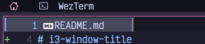

<h3 align="center">
  i3-window-title
</h3>

<p align="center">
  
  
  
  
<!-- ALL-CONTRIBUTORS-BADGE:START - Do not remove or modify this section -->
<a href='#contributors-'></a>
<!-- ALL-CONTRIBUTORS-BADGE:END -->
</p>

A small helper application to display the focused window's title in polybar, or similar.

It uses i3wm's official Go event subscription, so it updates instantly without polling.



## Installation

Download from [GitHub releases](https://github.com/nekowinston/i3-window-title/releases),
and move it to one of your `bin` directories, which is in your `$PATH`.

## Configuration

The config file is YAML format, located in `~/.config/window_titles.yml`:

```yaml
# the icon to fall back to, if there is no mapping
default_icon: ﬓ
# spaces to insert between the icon & window title
padding: 1
# auto-capitalize window titles, when they are not manually set.
capitalize: true

# show workspace info, when no window is focused.
workspace:
  # turning this off will always show the last window title
  enabled: true 
  # icon and title mapping for the workspace placeholder
  icon: ﬓ
  title: Desktop

# mappings for each application
mappings:
# class is the WM_CLASS, which you can get via xprop.
# NB: you can ignore casing, it doesn't matter if lower/uppercase
- class: firefox
  title: Firefox
  icon: 
- class: Pcmanfm
  title: PCManFM
  icon: 
- class: org.wezfurlong.wezterm
  title: WezTerm
  # you can use YAML anchors, to use icons again...
  icon: &term 
- class: kitty
  # ...like this:
  icon: *term
  title: Kitty
  # if this is enabled, the native title is shown,
  # as well as the mapped title.
  # e.g. Kitty [~/]
  show_native_title: true

# you can customize the separators for the
# 'show_native_title' titles. the conf below would show:
# 'Kitty (~/)' instead of 'Kitty [~/]'
native_title_separators:
  start: "("
  end: ")"
```

## Usage (polybar)

```ini
[module/window-title]
type = custom/script
exec = i3-window-title

; important! this is required to only show the last printed line in the bar
tail = true
```

## Contributors ✨

Thanks goes to these wonderful people ([emoji key](https://allcontributors.org/docs/en/emoji-key)):

<!-- ALL-CONTRIBUTORS-LIST:START - Do not remove or modify this section -->
<!-- prettier-ignore-start -->
<!-- markdownlint-disable -->
<table>
  <tr>
    <td align="center"><a href="https://winston.sh/"><br /><sub><b>winston</b></sub></a><br /><a href="https://github.com/nekowinston/i3-window-title/commits?author=nekowinston" title="Code">💻</a></td>
    <td align="center"><a href="https://github.com/Aurn1ox"><br /><sub><b>Aurn1ox</b></sub></a><br /><a href="#ideas-Aurn1ox" title="Ideas, Planning, & Feedback">🤔</a> <a href="#userTesting-Aurn1ox" title="User Testing">📓</a></td>
  </tr>
</table>

<!-- markdownlint-restore -->
<!-- prettier-ignore-end -->

<!-- ALL-CONTRIBUTORS-LIST:END -->

This project follows the [all-contributors](https://github.com/all-contributors/all-contributors) specification. Contributions of any kind welcome!
